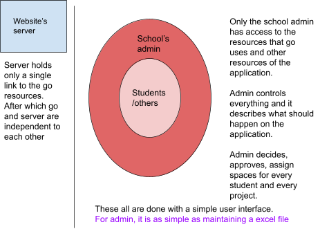
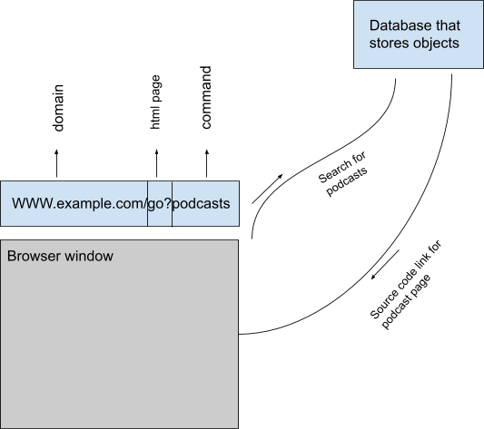

# dbs-web-go
 It is the repository which www.dobbsschool.com/go?{command} completely depends on
# go?
  go? is a basic architechture idea that help to access many web pages,web application,etc. on a single webpage with a query command.
  www.dobbsschool.com/go?settings will allow the admin/student-wesite-committee to have direct and complete access to the particular page (go) on the web server
# Problem solved by go
  Students who need to implement an idea on the school website cant get direct access to the hosting server for security reasons.As its difficult to contact the website maintainer   each time to execute the idea. go provies a pipe for school's admin/student-wesite-committee to write/delete media or even create new web-pages and web-application projects by     students and teachers
# Resources
  * domain for addressing(www.dobbsschool.com)
  * database server to save objects(firebase)
  * database to save media(github pages)
   
# Everything on go is controlled by admin on www.dobbsschool.com/go?settings

# imaging the go architechture
   

   

  
  
